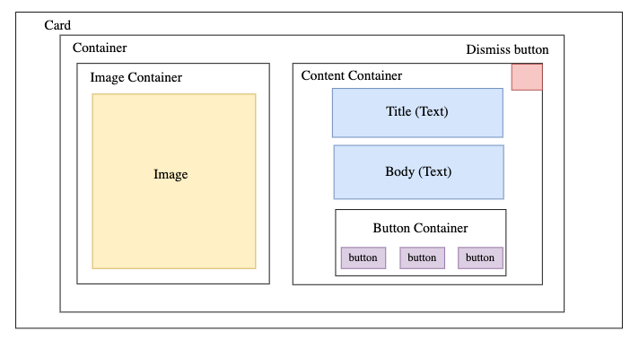
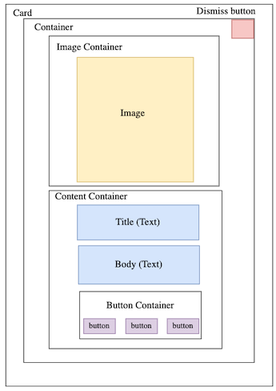
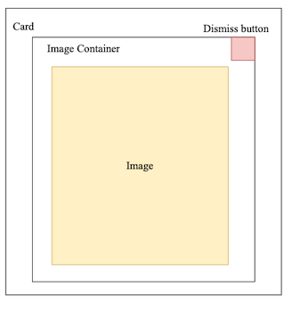

# Content Cards Tutorial

## Overview

Content Cards are a powerful feature of Adobe Journey Optimizer that allows you to deliver personalized, contextual content directly within your mobile application. Unlike push notifications or in-app messages, content cards provide a persistent, non-intrusive way to present relevant information to users when they're actively engaged with your app. Content cards are ideal for showcasing promotions, product recommendations, onboarding tips, or any contextual information that enhances the user experience without interrupting their workflow.

## Prerequisites

Before implementing content cards, ensure you have:

1. **Planned and defined surface identifiers** for locations where content cards should appear in your app (see [Defining Surface Identifiers](#defining-surface-identifiers) section below)

2. **Configured content card campaigns in Adobe Journey Optimizer** using your defined surface identifiers:

     a. Create a [channel](https://experienceleague.adobe.com/en/docs/journey-optimizer/using/channels/content-card/configure/content-card-configuration). (Define appid and surface)

     b. Create [content cards](https://experienceleague.adobe.com/en/docs/journey-optimizer/using/channels/content-card/create-content-card) - Follow "Add Content cards to a campaign".
     
     c. Design content cards with [templates](https://experienceleague.adobe.com/en/docs/journey-optimizer/using/channels/content-card/design-content-card)
     
3. **Integrated and registered the AEPMessaging extension** in your app (see [SDK Integration](#sdk-integration) section below) 

### Defining Surface Identifiers

Surface identifiers are string values that represent specific locations in your app where content cards will be displayed. These identifiers must match between your Adobe Journey Optimizer campaigns and your app code.

### Surface Naming Conventions

Use descriptive, hierarchical naming patterns:

// Feature-based surfaces
const surfaces = [
  'homepage',
  'product-detail', 
  'checkout',
  'profile',
  'search-results'
];

// Context-specific surfaces
const surfaces = [ <br>
  'rn/ios/remote_image',     // For remote image content cards <br>
  'rn/android/local_promo',  // For local promotional cards <br>
  'app/onboarding/step1'     // For onboarding flow <br>
];

### Where to Configure Surface Identifiers

Surface identifiers must be coordinated between two locations:

1. **Adobe Journey Optimizer**: When creating content card campaigns, specify the surface identifier in your campaign targeting configuration
2. **Your Mobile App**: Use the same surface identifiers when calling the Messaging APIs to fetch and display content cards

**Important**: The surface identifiers in your Adobe Journey Optimizer campaigns must exactly match the surface identifiers used in your app code. Mismatched identifiers will result in no content cards being returned.

## Template Types Overview

Content cards support three template types: SmallImage, LargeImage, and ImageOnly.

### Template Layouts

#### SmallImage Template
- **Layout:** Horizontal layout (flexDirection: 'row') with image on the left and content on the right
- **Components:** Image, title text, body text, action buttons, dismiss button (all optional)
- **Container Height:** 120px minimum height



#### LargeImage Template  
- **Layout:** Vertical layout with image at top and content below
- **Components:** Image, title text, body text, action buttons, dismiss button (all optional)
- **Image Width:** 100% of card width, maintains aspect ratio



#### ImageOnly Template
- **Layout:** Single image container
- **Components:** Image, optional dismiss button overlaid on the image
- **Image Size:** Full card size, maintains aspect ratio



For detailed customization options, see the [Content Card Customization Guide](./ContentCardCustomizationGuide.md).

## SDK Integration

Before you can fetch and display content cards, you need to install and configure the AEP React Native SDK. For detailed setup instructions, see the main [SDK Installation and Configuration Guide](https://github.com/adobe/aepsdk-react-native#requirements).

**Required packages:**
- [`@adobe/react-native-aepcore`](https://github.com/adobe/aepsdk-react-native/tree/main/packages/core) 
- [`@adobe/react-native-aepedge`](https://github.com/adobe/aepsdk-react-native/tree/main/packages/edge)
- [`@adobe/react-native-aepedgeidentity`](https://github.com/adobe/aepsdk-react-native/tree/main/packages/edgeidentity)
- [`@adobe/react-native-aepmessaging`](https://github.com/adobe/aepsdk-react-native/tree/content-card-ui/packages/messaging) 

```shell
//Important: Use the development branch for Messaging content card testing

npm install "https://gitpkg.now.sh/adobe/aepsdk-react-native/packages/messaging?content-card-ui"
```

**Optional packages:**
- [`@adobe/react-native-aepedgeconsent`](https://github.com/adobe/aepsdk-react-native/tree/main/packages/edgeconsent)

**Imports for content cards:**
```typescript
import { 
  Messaging,           // For manual API calls (advanced usage)
  ContentTemplate,     // Type definitions
  ContentCardView,     // Pre-built UI component
  useContentCardUI     // hook based approach for simplified state management
} from '@adobe/react-native-aepmessaging';
```

## Fetching Content Cards

For data fetching, you can use either the hook-based approach (recommended) or the manual implementation approach.

### Hook based Approach: Using the useContentCardUI Hook (Recommended)

The `useContentCardUI` hook provides a simplified, modern way to fetch and manage content cards with built-in state management, loading states, and error handling.

```typescript
import React from 'react';
import { View, FlatList, Text } from 'react-native';
import { useContentCardUI, ContentCardView } from '@adobe/react-native-aepmessaging';

const ContentCardsScreen = () => {
  const { content, isLoading, error } = useContentCardUI('homepage');

  if (isLoading) return <Text>Loading...</Text>;
  if (error) return <Text>Error loading content cards</Text>;

  return (
    <View style={{ flex: 1 }}>
      <FlatList
        data={content}
        keyExtractor={(item) => item.id}
        renderItem={({ item: card }) => (
          <ContentCardView
            template={card}
          />
        )}
        ListEmptyComponent={<Text>No content cards available</Text>}
      />
    </View>
  );
};
```

#### Benefits of the useContentCardUI Hook

- **Simplified Implementation**: No need to manually manage state, loading, or error handling
- **Automatic Lifecycle Management**: Automatically fetches content when surface changes
- **Built-in Performance**: Optimized with proper dependency management and memoization
- **Error Handling**: Includes built-in error states and retry functionality
- **Easy Refresh**: Simple `refetch()` function for manual content updates
- **Loading States**: Built-in loading indicators for better UX

#### useContentCardUI Hook API Reference

```typescript
const { content, isLoading, error, refetch } = useContentCardUI(surface);
```

| Property | Type | Description |
|----------|------|-------------|
| `content` | `ContentTemplate[]` | Array of content card templates ready for rendering |
| `isLoading` | `boolean` | Loading state indicator (optional) |
| `error` | `any \| null` | Error object if fetching fails (optional) |
| `refetch` | `() => Promise<void>` | Function to manually refresh content cards (optional) |

**Note**: While the basic example only uses `content`, the hook also provides `isLoading`, `error`, and `refetch` for enhanced functionality when needed.

### Alternative Approach: Manual Implementation

For alternative use cases where you need more control over the fetching process, you can use the manual approach:

#### Step 1: Update Propositions for Surfaces

To fetch content cards for specific surfaces configured in Adobe Journey Optimizer campaigns, call the `updatePropositionsForSurfaces` API. This method retrieves the latest content cards from the server and caches them in-memory for the application's lifecycle.

**Best Practice**: Batch requests for multiple surfaces in a single API call when possible to optimize performance.

```typescript
import { Messaging } from '@adobe/react-native-aepmessaging';

// Single surface example
const surface = 'homepage';

//Example 1 - Fetch content cards for a single surface
const updateContentCardsForSurface = async (): Promise<void> => {
  try {
    await Messaging.updatePropositionsForSurfaces([surface]);
    console.log('Content cards updated successfully for surface:', surface);
  } catch (error) {
    console.error('Failed to update content cards:', error);
  }
};

//Example 2 -  Multiple surfaces example (for batching requests)
const surfaces: string[] = ['homepage', 'product-detail', 'checkout'];

const updateContentCardsForMultipleSurfaces = async (): Promise<void> => {
  try {
    await Messaging.updatePropositionsForSurfaces(surfaces);
    console.log('Content cards updated successfully for all surfaces');
  } catch (error) {
    console.error('Failed to update content cards:', error);
  }
};
```

#### Step 2: Retrieve and Render Content Cards

After updating propositions, retrieve the content cards for a specific surface using the `getContentCardUI` API. This convenience method handles proposition filtering and returns ready-to-use content card templates.

**Important**: Only content cards for which the user has qualified are returned. User qualification is determined by the delivery rules configured in Adobe Journey Optimizer.

```typescript
import { Messaging, ContentTemplate } from '@adobe/react-native-aepmessaging';

//Example 1 - Simple approach: Get content card UI templates for a single surface
const getContentCards = async (surface: string): Promise<ContentTemplate[]> => {
  try {
    const contentCards = await Messaging.getContentCardUI(surface);
    console.log(`Found ${contentCards.length} content cards for surface: ${surface}`);
    return contentCards;
  } catch (error) {
    console.error('Error retrieving content cards:', error);
    return [];
  }
};

//Example 2 - For multiple surfaces, call getContentCardUI for each surface
const getContentCardsForMultipleSurfaces = async (surfaces: string[]): Promise<ContentTemplate[]> => {
  try {
    const allContentCards: ContentTemplate[] = [];
    
    for (const surface of surfaces) {
      const contentCards = await Messaging.getContentCardUI(surface);
      allContentCards.push(...contentCards);
    }
    
    console.log(`Found ${allContentCards.length} content cards across all surfaces`);
    return allContentCards;
  } catch (error) {
    console.error('Error retrieving content cards:', error);
    return [];
  }
};
```
f
## Rendering Content Cards

Content cards can be rendered using the pre-built `ContentCardView` component provided by the SDK. 

### React Native Implementation

```typescript
import React from 'react';
import { View, FlatList, Text } from 'react-native';
import { useContentCardUI, ContentCardView } from '@adobe/react-native-aepmessaging';

const ContentCardsScreen = () => {
  const { content, isLoading, error } = useContentCardUI('homepage');

  if (isLoading) return <Text>Loading...</Text>;
  if (error) return <Text>Error loading content cards</Text>;

  return (
    <View style={{ flex: 1 }}>
      <FlatList
        data={content}
        keyExtractor={(item) => item.id}
        renderItem={({ item: card }) => (
          <ContentCardView
            template={card}
          />
        )}
        ListEmptyComponent={<Text>No content cards available</Text>}
      />
    </View>
  );
};
```

### Choosing the Right Approach

| Approach | Best For | Advantages | When to Use |
|----------|----------|------------|-------------|
| **useContentCardUI Hook** | Most applications | • Minimal boilerplate<br>• Built-in state management<br>• Automatic error handling<br>• Easy to implement | • Standard content card implementation<br>• Getting started quickly<br>• Most common use cases |
| **Manual Implementation** | Advanced use cases | • Full control over fetching<br>• Custom state management<br>• Complex business logic<br>• Multiple surface coordination | • Complex content card workflows<br>• Custom caching strategies<br>• Integration with existing state management |

### Benefits of Using ContentCardView

The pre-built `ContentCardView` component provides several advantages regardless of which fetching approach you choose:

- **Automatic Layout**: Handles different card types (SmallImage, LargeImage, ImageOnly) automatically
- **Built-in Event Tracking**: Automatically tracks display and interaction events
- **Theme Support**: Works with `ThemeProvider` for consistent styling
- **Accessibility**: Includes proper accessibility features
- **Less Code**: No need to build custom UI components

### Customizing ContentCardView

You can customize the appearance of content cards using the `styleOverrides` prop:

```typescript
<ContentCardView
  key={card.id}
  template={card}
  listener={handleContentCardEvent}
  styleOverrides={{
    smallImageStyle: {
      title: {
        fontSize: 18,
        fontWeight: 'bold',
        color: '#333',
        numberOfLines: 2,
      },
      body: {
        fontSize: 14,
        color: '#666',
        numberOfLines: 3,
      },
      image: {
        borderRadius: 8,
      },
      button: {
        backgroundColor: '#007AFF',
        borderRadius: 6,
      }
    },
    largeImageStyle: {
      title: {
        fontSize: 20,
        fontWeight: '600',
        numberOfLines: 1,
      },
      body: {
        numberOfLines: 2,
      }
    },
    imageOnlyStyle: {
      image: {
        aspectRatio: 1,
        borderRadius: 12,
      }
    }
  }}
/>
```

**Note**: Different card types support different style properties. Refer to the [Content Card Customization Guide](./ContentCardCustomizationGuide.md) for comprehensive styling options.


## Automatic Event Tracking

When using `ContentCardView`, event tracking is handled automatically regardless of whether you use the `useContentCardUI` hook or manual implementation. The component tracks user interactions and sends events to Adobe Journey Optimizer for campaign measurement and optimization.

### Events Automatically Tracked

The `ContentCardView` component automatically tracks and sends the following events to Adobe Journey Optimizer:

#### Display Events
- **Triggered when**: A content card becomes visible on screen
- **Event data sent**: 
  - Proposition ID
  - Content card details
  - Surface information
  - Timestamp

#### Interaction Events  
- **Triggered when**: User taps on the content card or its action buttons
- **Event data sent**:
  - Proposition ID
  - Content card details
  - Interaction type (tap, button click)
  - Action URL (if applicable)
  - Timestamp

#### Dismiss Events
- **Triggered when**: User dismisses a content card (if dismiss button is shown)
- **Event data sent**:
  - Proposition ID
  - Content card details
  - Dismiss action
  - Timestamp

### Event Listener (Optional)

While tracking is automatic, you can still listen to events using the `listener` prop if you need to perform additional actions:

```typescript
const handleContentCardEvent = (event: string, card: ContentTemplate): void => {
  console.log('Content card event:', event, card);
  
  switch (event) {
    case 'display':
      console.log('Card displayed:', card.id);
      // Optional: Add custom analytics or logging
      break;
    case 'interact':
      console.log('Card interacted:', card.id);
      // Optional: Handle custom navigation or actions
      break;
    case 'dismiss':
      console.log('Card dismissed:', card.id);
      // Optional: Update local state or preferences
      break;
  }
};

// Use the listener in your ContentCardView
<ContentCardView
  template={card}
  listener={handleContentCardEvent}
/>
```
